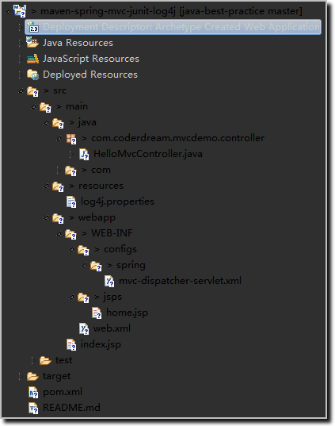
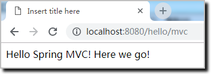

# Maven+Spring+MVC+JUnit+log4j+Jetty

根据日志配置文件中的级别配置，正确输出日志

- 项目结构：                                                                                                                                                                                                   


- 运行程序：
	- 选中项目，点击右键，【Run As】->【Run with Jetty】

- 浏览器输入：[http://localhost:8080/hello/mvc](http://localhost:8080/hello/mvc)    
	- 浏览器输出结果：                                                                                                                                                                                                                                                                                                                 


	- 控制台输出结果
```
2019-01-07 15:19:00,744  INFO [qtp1028214719-18] (HelloMvcController.java:24) - This is info message.
2019-01-07 15:19:00,745  WARN [qtp1028214719-18] (HelloMvcController.java:26) - This is warn message.
2019-01-07 15:19:00,745 ERROR [qtp1028214719-18] (HelloMvcController.java:28) - This is error message.
2019-01-07 15:19:00,745 FATAL [qtp1028214719-18] (HelloMvcController.java:30) - This is fatal message.
```

- 参考网页：
- [3-5 Hello Spring MVC](https://github.com/CoderDream/imooc-spring-mvc/releases/tag/v0.3.5)