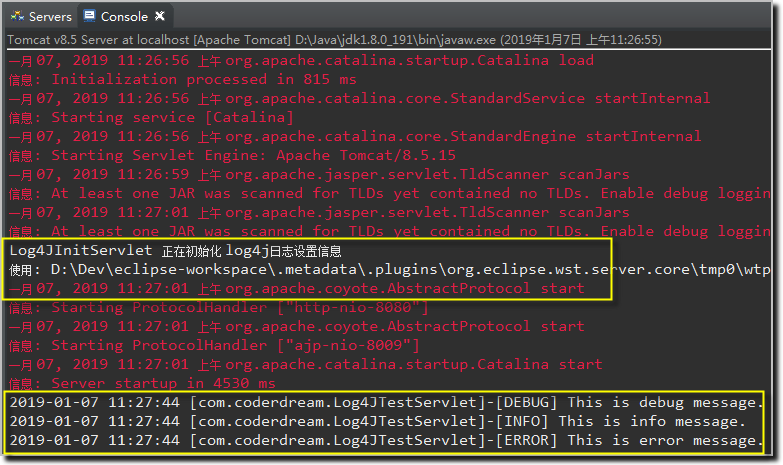

# Maven Web JUnit log4j


- 项目结构：                                                                                                                                                                                                   


- 代码清单：log4j.properties
```
#设置日志的级别，定义日志信息的输出目的
log4j.rootLogger=DEBUG, A1 ,R
#定义A1的输出目的地为控制台
log4j.appender.A1=org.apache.log4j.ConsoleAppender
#布局为 PatternLayout 可以灵活地指定布局模式。
log4j.appender.A1.layout=org.apache.log4j.PatternLayout
#设置输出格式
log4j.appender.A1.layout.ConversionPattern=%-d{yyyy-MM-dd HH\:mm\:ss} [%c]-[%p] %m%n
#定义R的输出目的地为文件，并且文件大小到达指定尺寸的时候产生一个新的文件
log4j.appender.R=org.apache.log4j.RollingFileAppender
#设置输出的文件地址
log4j.appender.R.File=D:\\Test_Log4j.log
#设置文件大小伟100 kb 文件到达100时，产生一个新文件，
#MaxBackupIndex 最大记录的文件数为1 查过一个文件删除文件较早的。
log4j.appender.R.MaxFileSize=100KB log4j.appender.R.MaxBackupIndex=1
#以下和上面一样
log4j.appender.R.layout=org.apache.log4j.PatternLayout
log4j.appender.R.layout.ConversionPattern=%p %t %c - %m%n
```

- 代码清单：pom.xml
```xml
<project xmlns="http://maven.apache.org/POM/4.0.0"
	xmlns:xsi="http://www.w3.org/2001/XMLSchema-instance"
	xsi:schemaLocation="http://maven.apache.org/POM/4.0.0 http://maven.apache.org/maven-v4_0_0.xsd">
	<modelVersion>4.0.0</modelVersion>
	<groupId>com.coderdream</groupId>
	<artifactId>maven-spring-mvc-junit-log4j</artifactId>
	<packaging>war</packaging>
	<version>0.0.1-SNAPSHOT</version>
	<name>maven-spring-mvc-junit-log4j Maven Webapp</name>
	<url>http://maven.apache.org</url>
	<dependencies>
		<dependency>
			<groupId>junit</groupId>
			<artifactId>junit</artifactId>
			<version>4.12</version>
			<scope>test</scope>
		</dependency>
		<!-- 日志文件管理包 -->
		<dependency>
			<groupId>log4j</groupId>
			<artifactId>log4j</artifactId>
			<version>1.2.17</version>
		</dependency>
		<dependency>
			<groupId>org.slf4j</groupId>
			<artifactId>slf4j-api</artifactId>
			<version>1.7.12</version>
		</dependency>
		<dependency>
			<groupId>org.slf4j</groupId>
			<artifactId>slf4j-log4j12</artifactId>
			<version>1.7.12</version>
		</dependency>
	</dependencies>
	<build>
		<finalName>maven-spring-mvc-junit-log4j</finalName>
	</build>
</project>

```

- 代码清单：Log4JInitServlet.java
```java
package com.coderdream;

import java.io.File;
import java.io.IOException;

import javax.servlet.ServletConfig;
import javax.servlet.ServletContext;
import javax.servlet.ServletException;
import javax.servlet.annotation.WebServlet;
import javax.servlet.http.HttpServlet;
import javax.servlet.http.HttpServletRequest;
import javax.servlet.http.HttpServletResponse;

import org.apache.log4j.BasicConfigurator;
import org.apache.log4j.PropertyConfigurator;

/**
 * Servlet implementation class Log4JInitServlet
 */
@WebServlet("/Log4JInitServlet")
public class Log4JInitServlet extends HttpServlet {
	private static final long serialVersionUID = 1L;

	/**
	 * @see HttpServlet#HttpServlet()
	 */
	public Log4JInitServlet() {
		super();
		// TODO Auto-generated constructor stub
	}

	/**
	 * @see Servlet#init(ServletConfig)
	 */
	public void init(ServletConfig config) throws ServletException {
		System.out.println("Log4JInitServlet 正在初始化 log4j日志设置信息");
		String log4jLocation = config.getInitParameter("log4j-properties-location");

		ServletContext sc = config.getServletContext();

		if (log4jLocation == null) {
			System.err.println("*** 没有 log4j-properties-location 初始化的文件, 所以使用 BasicConfigurator初始化");
			BasicConfigurator.configure();
		} else {
			String webAppPath = sc.getRealPath("/");
			String log4jProp = webAppPath + log4jLocation;
			File log4jFile = new File(log4jProp);
			if (log4jFile.exists()) {
				System.out.println("使用: " + log4jProp + "初始化日志设置信息");
				PropertyConfigurator.configure(log4jProp);
			} else {
				System.err.println("*** " + log4jProp + " 文件没有找到， 所以使用 BasicConfigurator初始化");
				BasicConfigurator.configure();
			}
		}
		super.init(config);
	}

	/**
	 * @see HttpServlet#doGet(HttpServletRequest request, HttpServletResponse
	 *      response)
	 */
	protected void doGet(HttpServletRequest request, HttpServletResponse response)
			throws ServletException, IOException {
		// TODO Auto-generated method stub
	}

	/**
	 * @see HttpServlet#doPost(HttpServletRequest request, HttpServletResponse
	 *      response)
	 */
	protected void doPost(HttpServletRequest request, HttpServletResponse response)
			throws ServletException, IOException {
		// TODO Auto-generated method stub
	}

}
```

- 代码清单：Log4JTestServlet.java
```java
package com.coderdream;

import java.io.IOException;  
 
import javax.servlet.ServletConfig;  
import javax.servlet.ServletException;  
import javax.servlet.annotation.WebServlet;  
import javax.servlet.http.HttpServlet;  
import javax.servlet.http.HttpServletRequest;  
import javax.servlet.http.HttpServletResponse;  
 
import org.apache.log4j.Logger;  
 
/** 
 * Servlet implementation class Log4JTestServlet 
 */  
@WebServlet("/Log4JTestServlet")  
public class Log4JTestServlet extends HttpServlet {  
    private static final long serialVersionUID = 1L;  
    private static Logger logger = Logger.getLogger(Log4JTestServlet.class);    
 
    /** 
     * @see HttpServlet#HttpServlet() 
     */  
    public Log4JTestServlet() {  
        super();  
        // TODO Auto-generated constructor stub  
    }  
 
    /** 
     * @see Servlet#init(ServletConfig) 
     */  
    public void init(ServletConfig config) throws ServletException {  
        // TODO Auto-generated method stub  
    }  
 
    /** 
     * @see HttpServlet#doGet(HttpServletRequest request, HttpServletResponse response) 
     */  
    protected void doGet(HttpServletRequest request, HttpServletResponse response) throws ServletException, IOException {  
        // 记录debug级别的信息    
        logger.debug("This is debug message.");    
        // 记录info级别的信息    
        logger.info("This is info message.");    
        // 记录error级别的信息    
        logger.error("This is error message.");    
    }  
 
    /** 
     * @see HttpServlet#doPost(HttpServletRequest request, HttpServletResponse response) 
     */  
    protected void doPost(HttpServletRequest request, HttpServletResponse response) throws ServletException, IOException {  
        doGet(request,response);  
    }  
 
}

```

- 浏览器输入：http://localhost:8080/maven-spring-mvc-junit-log4j/test



参考文档：
1. [解决log4j.properties不起作用的问题](https://blog.csdn.net/l_degege/article/details/80201114)
2. [搭建：Maven + log4j](https://blog.csdn.net/u010975589/article/details/80886133)
3. [Junit单元测试使用log4j输出日志](https://blog.csdn.net/qq_33458228/article/details/80810280)

