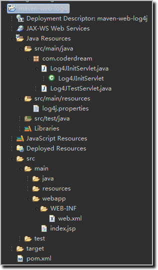

# Maven JUnit log4j


- 项目结构：                                                                                                                                                                                                   


- 代码清单：log4j.properties
```
#设置日志的级别，定义日志信息的输出目的
log4j.rootLogger=DEBUG, A1 ,R
#定义A1的输出目的地为控制台
log4j.appender.A1=org.apache.log4j.ConsoleAppender
#布局为 PatternLayout 可以灵活地指定布局模式。
log4j.appender.A1.layout=org.apache.log4j.PatternLayout
#设置输出格式
log4j.appender.A1.layout.ConversionPattern=%-d{yyyy-MM-dd HH\:mm\:ss} [%c]-[%p] %m%n
#定义R的输出目的地为文件，并且文件大小到达指定尺寸的时候产生一个新的文件
log4j.appender.R=org.apache.log4j.RollingFileAppender
#设置输出的文件地址
log4j.appender.R.File=D:\\Test_Log4j.log
#设置文件大小伟100 kb 文件到达100时，产生一个新文件，
#MaxBackupIndex 最大记录的文件数为1 查过一个文件删除文件较早的。
log4j.appender.R.MaxFileSize=100KB log4j.appender.R.MaxBackupIndex=1
#以下和上面一样
log4j.appender.R.layout=org.apache.log4j.PatternLayout
log4j.appender.R.layout.ConversionPattern=%p %t %c - %m%n
```

- 代码清单：pom.xml
```xml
<project xmlns="http://maven.apache.org/POM/4.0.0"
	xmlns:xsi="http://www.w3.org/2001/XMLSchema-instance"
	xsi:schemaLocation="http://maven.apache.org/POM/4.0.0 http://maven.apache.org/maven-v4_0_0.xsd">
	<modelVersion>4.0.0</modelVersion>
	<groupId>com.coderdream</groupId>
	<artifactId>maven-web-log4j</artifactId>
	<packaging>war</packaging>
	<version>0.0.1-SNAPSHOT</version>
	<name>maven-web-log4j Maven Webapp</name>
	<url>http://maven.apache.org</url>
	<dependencies>
		<dependency>
			<groupId>junit</groupId>
			<artifactId>junit</artifactId>
			<version>4.12</version>
			<scope>test</scope>
		</dependency>
		<!-- 日志文件管理包 -->
		<dependency>
			<groupId>log4j</groupId>
			<artifactId>log4j</artifactId>
			<version>1.2.17</version>
		</dependency>
		<dependency>
			<groupId>org.slf4j</groupId>
			<artifactId>slf4j-api</artifactId>
			<version>1.7.12</version>
		</dependency>
		<dependency>
			<groupId>org.slf4j</groupId>
			<artifactId>slf4j-log4j12</artifactId>
			<version>1.7.12</version>
		</dependency>
	</dependencies>
	<build>
		<finalName>maven-web-log4j</finalName>
	</build>
</project>

```

- 代码清单：Test.java（Java Application）
```java
package com.coderdream;

import org.apache.log4j.Logger;

public class Test {
	private static Logger logger = Logger.getLogger(Test.class);

	public static void main(String[] args) {
		logger.debug(" This is debug!!!");
		logger.info(" This is info!!!");
		logger.warn(" This is warn!!!");
		logger.error(" This is error!!!");
		logger.fatal(" This is fatal!!!");
	}
}
```

- 输出结果：
```
2019-01-07 10:43:32 [com.coderdream.Test]-[ERROR]  This is error!!!
2019-01-07 10:43:32 [com.coderdream.Test]-[FATAL]  This is fatal!!!
```

- 代码清单：TestLog.java（JUnit）
```java
package com.coderdream;

import org.junit.Test;
import org.apache.log4j.Logger;

public class TestLog {

	private static Logger logger = Logger.getLogger(TestLog.class);

	@Test
	public void testHello() {
		logger.debug(" This is debug!!!");
		logger.info(" This is info!!!");
		logger.warn(" This is warn!!!");
		logger.error(" This is error!!!");
		logger.fatal(" This is fatal!!!");
	}

}
```

- 输出结果：
```
2019-01-07 10:43:55 [com.coderdream.TestLog]-[ERROR]  This is error!!!
2019-01-07 10:43:55 [com.coderdream.TestLog]-[FATAL]  This is fatal!!!
```


参考文档：
1. [解决log4j.properties不起作用的问题](https://blog.csdn.net/l_degege/article/details/80201114)
2. [搭建：Maven + log4j](https://blog.csdn.net/u010975589/article/details/80886133)

